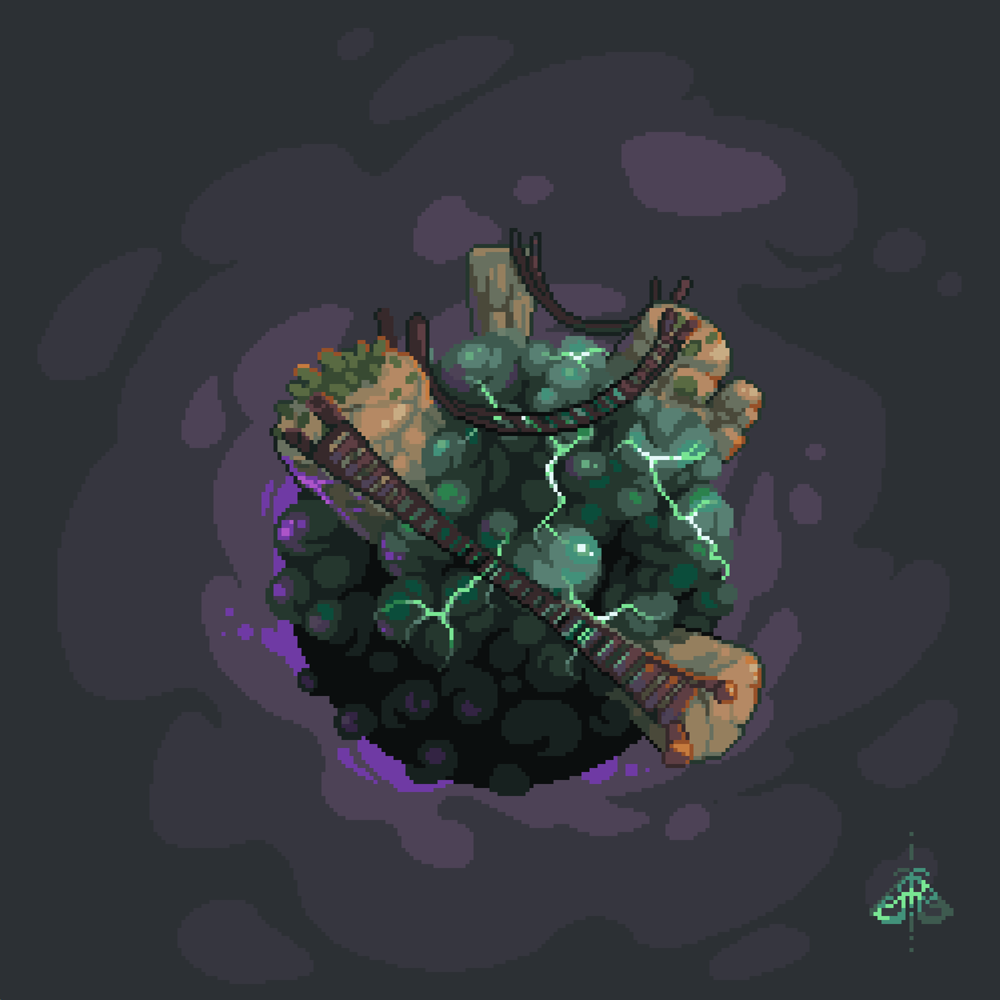

# Le Fogg

> **Le Fogg est un brouillard électromagnétique infranchissable aux propriétés uniques.** Il permet au Hava Inférieur d’exister, d’être si luxuriant et d’être protégé de la folie des derniers hommes du Hava Supérieur.

## Origines

**La fuite en avant des hommes causa la perte des civilisations terrestres.** C’est à cause de l’action économique humaine des guerres nucléaires toujours plus furieuses et destructrice que la chaleur planétaire accéléra inlassablement. A force de pollutions et de dégradations, la planète finit méconnaissable. La couche d’ozone ne protégeait plus assez le sol des rayons solaires et les derniers êtres vivants durent s’exiler dans les cavités profondes de la croute terrestre pour survivre à la hausse drastique des températures.&#x20;

**Au cours des millénaires suivants,** la chaleur accumulée dans les océans se relâcha progressivement dans l’atmosphère et les étendues d’eau, recouvrant autrefois 70% de la planète, s’asséchèrent. Bientôt il ne resta rien du monde d’avant. L’eau évaporée relâcha une importante quantité de CO2 et de chaleur dans l’atmosphère rendant celui-ci irrespirable pour la plupart des espèces, et provoquant une série d’orages sans pluie continue sur 32 000 ans.&#x20;

**Pendant longtemps,** il ne fallait que tendre l’oreille depuis une cavité profonde pour comprendre que le monde était encore en crise. Le sel, les métaux lourds et les déchets toxiques qui ne purent s’évaporer finirent d’achever les sols pendant des centaines d’années, voir des milliers pour certaines régions.&#x20;

**Au fur et à mesures des siècles,** l’intensité électrostatique présente dans le ciel s’est atténué et s’est concentrée sous l’effet des vents et de la lente reformation de la couche d’ozone et de l’atmosphère terrestre. A mesure que l’air redevenait respirable, les orages secs se concentrèrent toujours plus pour former un brouillard électrostatique dense stabilisé à l’ancien niveau 0 des océans. **Ce brouillard, les havaïs l’ont baptisés le Fogg.**

## Propriétés naturelles

<mark style="color:red;">Le Fogg est mortel pour les êtres vivants.</mark> Il perturbe les appareils électroniques, il concentre des niveaux mortels d’argon, d’hélium et d’azote, et il est constamment traversé d’arcs électriques. Parfois même, on peut apercevoir des orages inversés, partant du Fogg et tirant des éclairs dirigés vers le ciel. **C’est la barrière naturelle infranchissable entre le Hava Supérieur et Inférieur.**

En dehors de sa mortalité évidente, il possède une opacité qui bloque la majorité des rayonnements infrarouge et ultraviolet, ne laissant filtrer qu’une lumière jaune pâle douce, suffisamment forte pour éclairer et nourrir un monde fait de plantes et suffisamment faible pour empêcher sa combustion. Il laisse aussi passer l’oxygène des arbres du dessous pour permettre aux créatures du dessus de respirer. **En somme, le Fogg est la clé de l’équilibre de la vie sur Hava.** C’est ce qui cache la richesse naturelle de la planète, et aussi ce qui lui permet d’exister.

## Traversées

**Aucun havaï n’est jamais revenu de sa traversée du Fogg.** Quiconque le traverse sera pris d’un irrémédiable fou-rire suivi d’une implosion fugace des organes internes pour enfin conclure sur un foudroiement ou une explosion comme un pop-corn au micro-onde. Au choix. Il n’est pas dans la culture des havaïs du monde inférieur d’aller à l’encontre d’un phénomène naturel, ce qui est l’extrême opposée de la culture des havaïs du monde supérieurs, en quête de consommation de ressources.

Cependant, quelques téméraires ont trouvés des moyens de traverser le Fogg durant l’histoire de Hava. Mais peu importe s’ils venaient d’en haut ou d’en bas, tous ont finalement compris l’intérêt de préserver leurs découvertes pour ne pas détruire l’équilibre fragile de la vie que permettait le Fogg.
