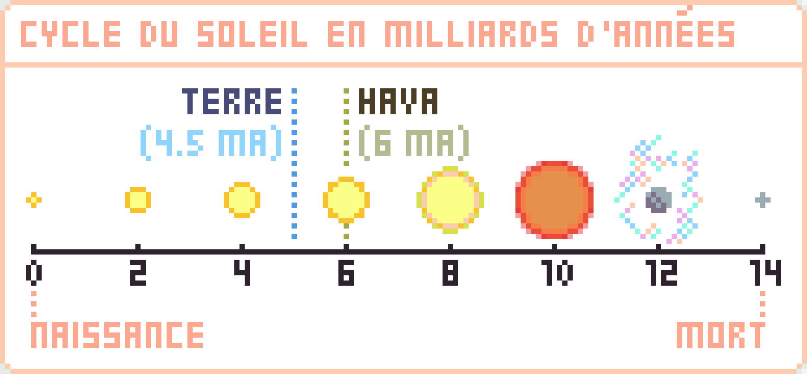

# Introduction

## Il était une fois...

> **Hava est la 3ème planète du système solaire,** aussi appelé système Sol. \
> **C’est l’histoire de la Terre,** un milliard et demi d’années après l’ère des humains.

## Chronologie

**Hava est une vieille planète.** Un astre ancien qui se serait bien passé de deux ou trois cataclysmes à sa surface, mais qui fait malgré tout preuve d’une forme olympique pour son âge. Elle a plusieurs fois connue la vie à travers toutes sortes de civilisations mais c’est bien aujourd’hui qu’elle est la plus diversifiée et intéressante de toute son histoire.

On peut extrapoler **l’âge de Hava** par rapport à **l’âge de Sol** en suivant le schéma ci-dessous :&#x20;

De la naissance à la mort de Hava, on distingue 3 ères, gentiment illustrées ci-dessous :&#x20;

Effectivement, la durée d’existence des humain·es est proportionnellement misérable comparée à la durée totale de la vie de Hava. **Cependant, elle est au moins aussi ridicule qu’elle n’a été destructrice**. Dans le “Hominis Historicae”, œuvre de 7 volumes qui rassemble l’essentiel de ce que l’on sait aujourd’hui des anciens humains, l’auteur conclut son analyse de cette civilisation par cette phrase : _“C’était quand même une belle bande d’abrutis”._ Autant l’ère sauropside a accueilli une vie simple, autant l’ère humaine a dépassé toutes les limites de ce qu’il est possible de limiter.

## Les Dinosaures

**L’ère sauropside étant le premier âge,** il a permis à la civilisation de lentement se développer dans un environnement absolument idyllique. Des océans à perte de vue, un continent unique et luxuriant, un décor à faire pâlir de jalousie tout agence de voyage : les dinosaures ont eu de la chance. Dans cet incubateur, Hava a pu expérimenter des assemblages du vivant pour le moins incongrus. Des créatures grossières, imparfaites, pas toujours adroites sur leurs pattes, mais là où une créature faiblissait, une autre en tirait un avantage pour sa survie. Ainsi, le cycle de la vie s’opérait dans un grand orchestre naturel qui s’est complexifié et optimisé de millénaire en millénaire.

**Dans cette découverte incroyable des possibilités du vivant,** les dinosaures devinrent rapidement l’espèce dominante. Ils grandirent, grossirent, se boursoufflèrent de narcissisme même. Et c’est pile au moment où leur civilisation s'enorgueillit d’avoir tout compris sur Hava, qu’un astre rival du nom de Centaurin envoya sur celle-ci un colis express de 80km de diamètre globalement composé de roches et de micro-saloperies, qui vint s’échouer sur ce qui est pour vous l’Amérique du Sud, avec la force de 10 milliards de bombes atomiques. Ce à quoi, rétrospectivement, la plupart des géologues actuels ont convenu·es que tout de même, c’était pas de chance pour les dinosaures. Après pareille déclaration, iels allèrent ensuite bien vite s’enfuir autour de la machine à café, car après tout, c’est ce fameux manque de chance qui leur a permis d’exister, eux géologues. On ne retient donc aujourd’hui de l’ère sauropside que quelques gros ossements et déjections fossilisées tout à fait spectaculaires.

## Les Humains

**On aurait alors pu croire que les insectes,** grands survivants de la fin des dinosaures, s’élèveraient alors sur la grande pyramide de l’évolution. Il s’avère encore une fois que la loi du plus fort s’en fiche pas mal du nombre d’individus dans votre fourmilière ou du fait que vous êtes capable de construire une ruche alvéolaire complexe en seulement quelques jours. Car la suite de l’histoire est en fait dominée par une bande de grands singes impulsifs confondant leurs crottes de nez avec des cacahuètes : **les Humains**. Jamais la vie n’avait arborée de forme aussi formidablement décevante que les humains de la Terre. Leur passage fût court et intense. N’ayant aucune conscience de devoir leur existence à l’astre sur lequel ils marchaient, ils en conclurent que ce devait être là une formidable source de profit gracieusement envoyée par un vieux barbu en toge. Vous conviendrez donc de l’étonnement marqué d’incrédulité qui se lit sur les visages des havaïs d’aujourd’hui à l’évocation des farfelus humains.

**Cette partie de l’histoire restera à jamais la période noire de Hava**. Les humains avaient un avantage certain sur les autres espèces de la planète, quelque chose que personne n’avait fait avant car personne n’avait été assez stupide pour le faire : **ils n’en avaient rien à péter**. Toute espèce un minimum intelligente sait qu’un verre d’eau plein contient une quantité finie d’eau, et donc qu’il faut économiser cette eau, comprendre comment elle se renouvelle dans le verre, et comment elle fonctionne dans son environnement. Les humains, eux, ne pigent rien à tout ce charabia, boivent l’eau cul-sec et se servent du verre pour se fabriquer des téléphones qui ne servent pas à téléphoner et des verres correcteurs pour continuer à regarder les écrans de téléphone. En cela, les humains ont complètement maîtrisés la transformation de la matière au détriment de tout respect et de toute logique envers lesdites matières, mais aussi l’art des paradoxes absurdes.

### L’Exode humaine

**À l’échelle des astres du système Sol,** on observait la situation de Hava sans mot dire. Enfin, si tant est qu’un astre ne possède pas de cordes vocales lui permettant de produire des sons. Communiquer entre astres revient plus à interpréter les signaux naturels des autres astres pour en déduire un langage développé : **le langage de l’univers**. Ainsi, d’ordinaire les 8 astres du système parlent beaucoup. L’énorme caillou envoyé par Centaurin à Hava est, par exemple, l’évocation manifeste d’un profond désaccord entre les deux astres sur la manière de développer la vie, ce qui se solda par l’arrêt net du développement de celle de Hava. Mais pour le bien-être de votre compréhension du monde, je tâcherai de traduire tout ça en mots.

**Les astres donc, parlent beaucoup.** Certains d’entre eux accueillent la vie sur leur surface et en sont très fiers. Mais tous regardent Hava comme la pariât du système. Les humains ont laissés dans leur sillage un astre vidé, détruit et drainé de toute création qui a mis des centaines de milliers d’années à se reconstruire. À la fin de leur histoire, voyant que la fuite en avant était inexorable, les humains entreprirent de quitter Hava pour ne surtout rien changer mais sur un astre voisin pas trop démoli. À l’annonce de cette nouvelle de Hava aux autres astres, c’est tout le système (même les lunes, les astres nains et le soleil lui-même) qui prirent peur de chopper ce qu’on appelait alors le “parasite de l’humanité”. Et comme personne ne voulait les accueillir, ils s’accordèrent sur le fait qu’il fallait à tout prix les faire disparaitre. C’est là que toute l’ironie de la situation explosa. Littéralement. Car pendant les quelques centaines d’années qu’il fallut à Hava pour avertir les autres, et aux autres pour comprendre et réagir au message, les humains s’autodétruirent avant de pouvoir décoller.

**Les raisons restent très floues pour les historiens actuels,** mais l’hypothèse la plus probable est que le fragile équilibre sur lequel reposait tout la société humaine fut rompu en une après-midi après qu’un petit homme caucasien possédant le bouton nucléaire ne menace un petit homme asiatique assit à l’autre bout du globe et possédant le même genre de bouton, de lui laisser une place dans son arche sinon personne ne partirait. S’en suivit une réaction en chaîne qui prit tout le monde de court et chaque nation humaine fut pressé d’admettre de près où de loin son allégeance à tel ou tel camp devant l’urgence de la situation. Bientôt, les vieilles querelles internationales se réveillèrent et ce fut la cacophonie la plus totale. Fait marquant, les seuls humains à avoir vraiment fuit sont ceux du petit territoire du Pays Basque en France, qui dans un _“fait chier, j’me casse”_ tonitruant, partirent comme ils étaient venus il y a des millénaires : en vaisseau spatial. \
On ne les revit plus jamais.

### Ce qu’il reste des humains

**Comme pour l’ère des dinosaures, l’ère humaine prit fin dans un incroyable concert d’explosions nucléaires en chaîne.** Mais à la différence des 10 milliards de giga-joules qu’il fallu à l’astéroïde de Centaurin pour pulvériser de gros lézards, il n’en suffit aux humains qu’un petit millier pour en finir avec la cuisine anglaise, les produits chinois, et tout le reste.

**On peut bien sûr parler des anciens humains pendant des semaines entières sans interruption,** mais ce n’est pas la partie qui nous intéresse. Leur monde n’existe plus, ou presque. Car dans un très malheureux hasard, un bon millier de membres d’une secte euthanasiste\* survécurent dans leur bunker très profond pendant suffisamment longtemps pour perdurer. Ils eurent la bonne idée de reporter la séance de suicide collectif au jeudi suivant, ce qui leur permi de vivre l’apocalypse depuis leur bunker, de mesurer l’ampleur de la fin de tout, de ressentir l’intensité de l’instinct de survie, et de finalement décider de ne plus jamais parler de “suicide” ou “d’euthanasie”. Ils essayèrent ensuite de reconstruire la civilisation en vain, car leur cerveau d’homo-sapiens couplé au trauma de la fin du monde les a finalement fait s’autodétruire à leur tour. Par chance, ils ont réussi à cloner des grands singes qui leur survécurent et réévoluèrent en hominidés quelques million d’années plus tard, pour former les actuels nouveaux humains du Hava supérieur. Le règne d’homo-sapiens n’est plus, désormais ce sont plusieurs nouveaux types du genre homo qui peuplent les déserts havaïs.
